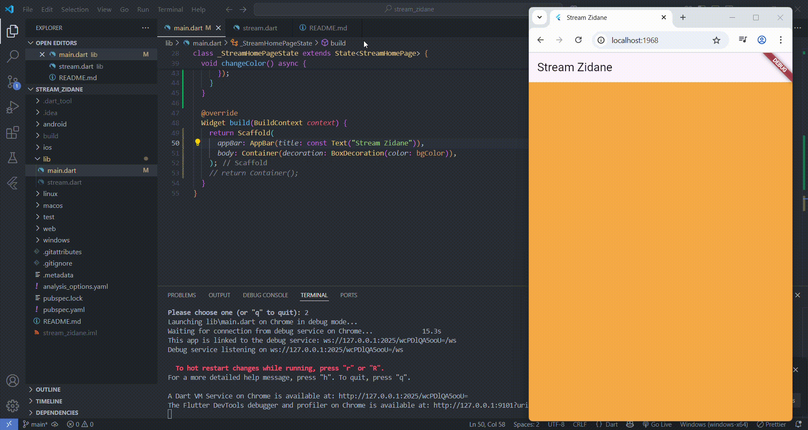

# stream_zidane

A new Flutter project.

## Praktikum 1
### Soal 3
* yield* adalah keyword dalam Dart yang digunakan untuk menggabungkan (delegate) stream atau iterable dari fungsi generator lain ke dalam generator kita.
Kalau yield mengirim satu nilai, maka yield* mengirim semua nilai dari stream atau iterable lain, seolah-olah mereka dikirim langsung dari fungsi kita.

* Penjelasan Kode:
    1. Stream.periodic(...) akan membuat stream yang memancarkan nilai setiap detik (Duration(seconds: 1)).
    2. Fungsi (int t) { ... } dijalankan setiap kali stream memancarkan nilai. 
        - t adalah penghitung waktu (0, 1, 2, ...).
        - index = t % colors.length akan memutar indeks warna agar tidak keluar dari list.
        - return colors[index]; akan mengambil warna dari list berdasarkan indeks yang diputar.
    3. yield* akan mendelegasikan seluruh isi stream ini, sehingga fungsi getColors menjadi stream juga.

### Soal 4

### Soal 5
**listen()** digunakan untuk respon langsung & berkelanjutan seperti notifikasi, event, atau UI yang terus diperbarui.
**await for** ketika ingin proses terstruktur, satu per satu, atau ketika memproses data stream secara berurutan.