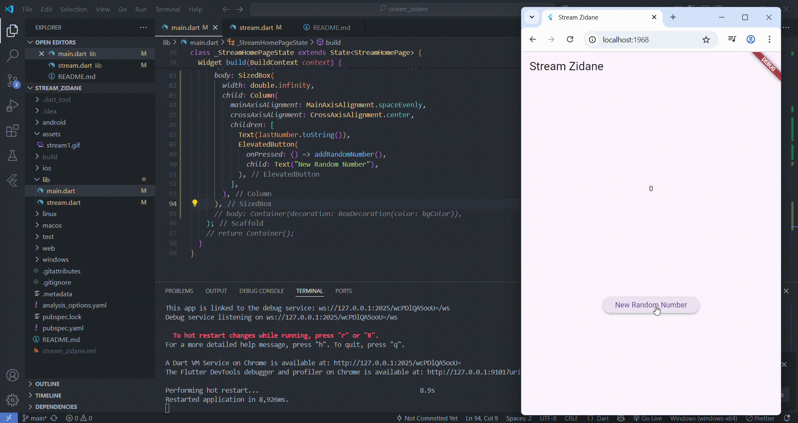
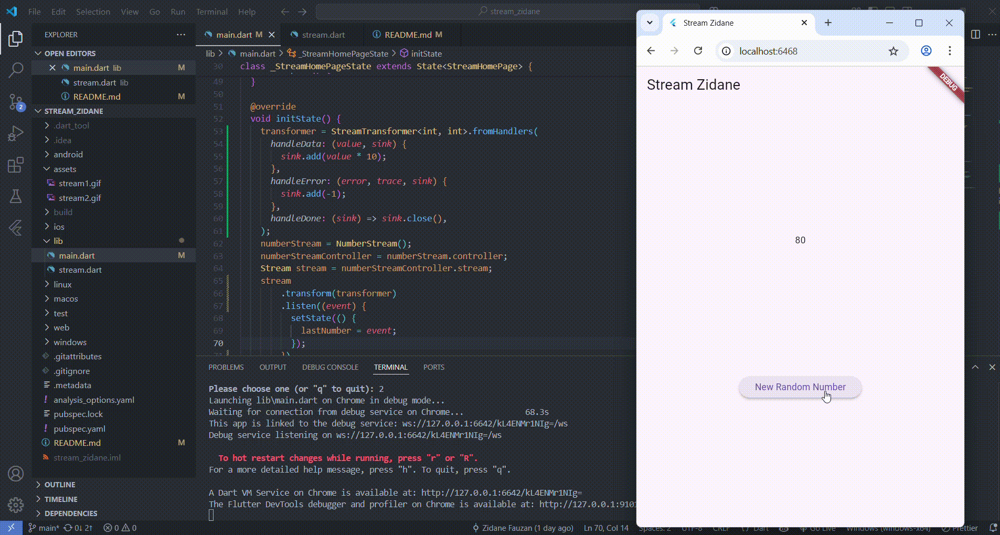
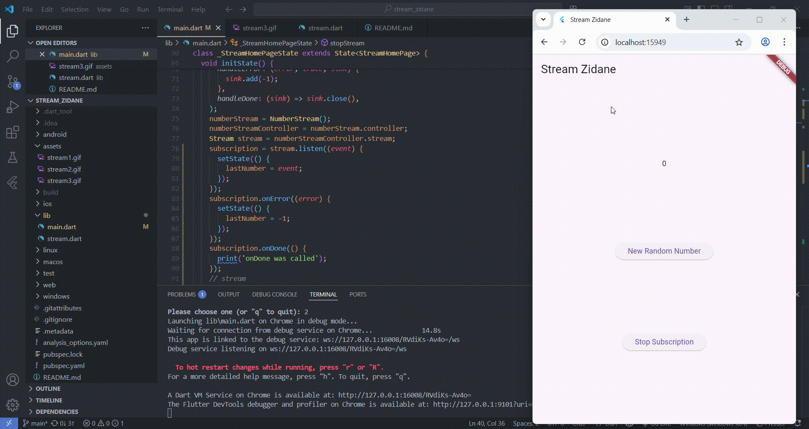
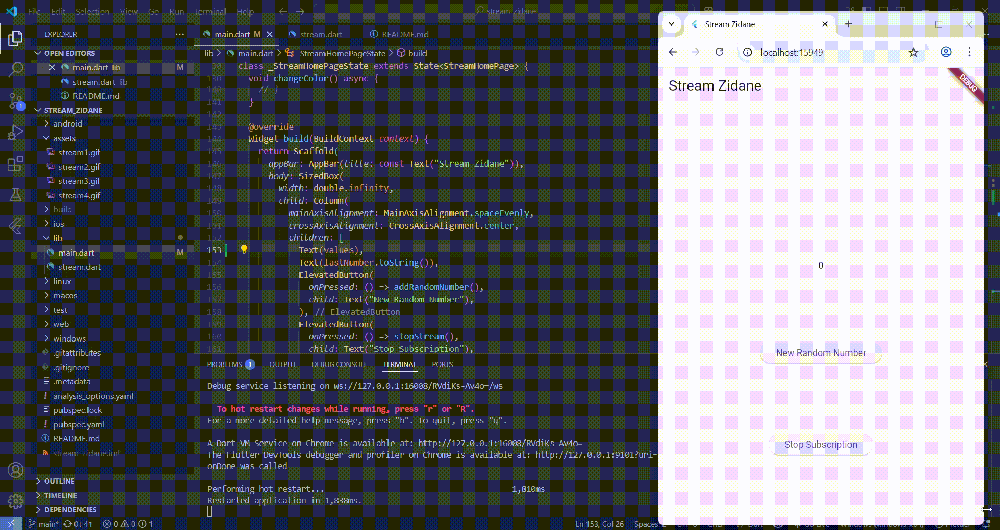

# stream_zidane

A new Flutter project.

## Praktikum 1
### Soal 3
* yield* adalah keyword dalam Dart yang digunakan untuk menggabungkan (delegate) stream atau iterable dari fungsi generator lain ke dalam generator kita.
Kalau yield mengirim satu nilai, maka yield* mengirim semua nilai dari stream atau iterable lain, seolah-olah mereka dikirim langsung dari fungsi kita.

* Penjelasan Kode:
    1. Stream.periodic(...) akan membuat stream yang memancarkan nilai setiap detik (Duration(seconds: 1)).
    2. Fungsi (int t) { ... } dijalankan setiap kali stream memancarkan nilai. 
        - t adalah penghitung waktu (0, 1, 2, ...).
        - index = t % colors.length akan memutar indeks warna agar tidak keluar dari list.
        - return colors[index]; akan mengambil warna dari list berdasarkan indeks yang diputar.
    3. yield* akan mendelegasikan seluruh isi stream ini, sehingga fungsi getColors menjadi stream juga.

### Soal 4

### Soal 5
**listen()** digunakan untuk respon langsung & berkelanjutan seperti notifikasi, event, atau UI yang terus diperbarui.
**await for** ketika ingin proses terstruktur, satu per satu, atau ketika memproses data stream secara berurutan.

## Praktikum 2
### Soal 6

1. Langkah 8
Menginisialisasi stream listener saat widget pertama kali dibangun, dan menyiapkan agar setiap data baru dari stream langsung mengupdate UI dengan setState.

2. Langkah 10
Mengirim angka acak ke stream, yang akan diterima oleh listener di initState(), dan menyebabkan lastNumber diupdate serta UI diperbarui.

### Soal 7

1. Langkah 13
Method digunakan untuk memasukkan error ke dalam stream menggunakan sink.addError(). "error" adalah nilai error-nya (dalam kasus ini, hanya sebuah string).

2. Langkah 14
onError(...) adalah callback untuk menangani error saat mendengarkan stream. Ini penting agar aplikasi kamu tidak crash jika terjadi kesalahan pada stream, dan kamu bisa menampilkan sesuatu sebagai penanda error ke pengguna atau developer.

3. Langkah 15
Method memanggil addError() dari numberStream, yang berarti mengirim error ke dalam stream.

## Praktikum 3
### Soal 8

1. Langkah 1
late artinya variabel transformer akan diinisialisasi nanti sebelum digunakan. StreamTransformer adalah objek yang bisa mengubah isi stream sebelum dikonsumsi oleh listen.

2. Langkah 3
Menerapkan transformasi ke stream. Output dari stream yang ditransformasi akan berbeda sesuai logika transformer tersebut.

## Praktikum 4
### Soal 9

1. Langkah 2
Mengatur stream subscription untuk menerima data dari stream. Ini memungkinkan UI diperbarui secara real-time berdasarkan data dari stream.

2. Langkah 6
Membersihkan subscription untuk mencegah memory leak.

3. Langkah 8
Mengirim angka acak ke dalam stream melalui sink. Cek dulu apakah controller masih aktif (belum ditutup). Jika stream sudah ditutup, tampilkan -1 agar user tahu tidak ada data baru yang dikirim.

## Praktikum 5
### Soal 10
Error "Bad state: Stream has already been listened to" terjadi karena mencoba mendengarkan (listen) sebuah Stream lebih dari satu kali, padahal itu bukan broadcast stream.

### Soal 11

Ketika tekan button ‘New Random Number' beberapa kali, maka akan tampil teks angka terus bertambah sebanyak dua kali. Hal ini terjadi karena menambahkan dua listener (listen) pada stream yang sama, setiap kali tombol New Random Number ditekan, 1 angka acak dikirim ke stream — namun karena ada dua listener aktif, maka callback setState dijalankan dua kali, dan nilai angka ditambahkan ke teks sebanyak dua kali.